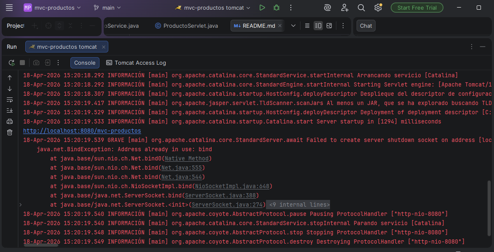
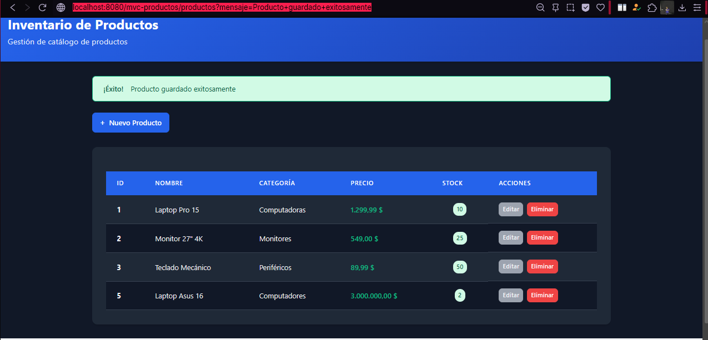
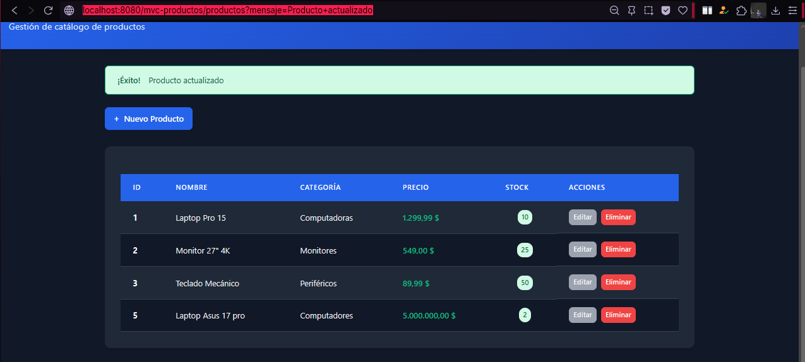
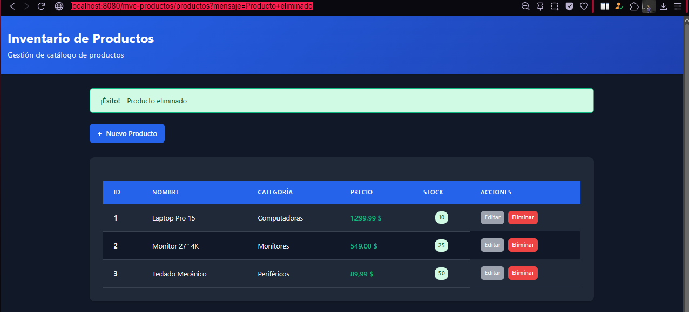
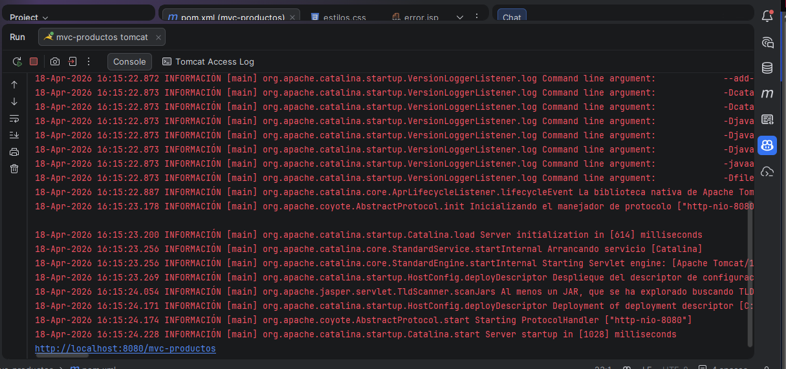

# CRUD de Productos con MVC - Java Web

**Nombre:** Jhoseth Esneider Rozo Carrillo  
**Código:** 02230131027  
**Programa:** Ingeniería de Sistemas  
**Unidad:** Unidad 6 – JSP con MVC
**Actividad:** Post-Contenido 1
**Fecha:** 18/04/2026

---

## Descripción del Proyecto

Este proyecto consiste en el desarrollo de una aplicación web en Java que implementa el patrón de arquitectura MVC (Modelo - Vista - Controlador), utilizando:

- Servlets como controlador
- JSP con Expression Language (EL) y JSTL como vista
- Clases Java como modelo

La aplicación permite realizar operaciones CRUD (Crear, Leer, Actualizar y Eliminar) sobre un conjunto de productos almacenados en memoria.

Se implementa el patrón Post/Redirect/Get (PRG) para evitar el reenvío de formularios y mejorar la experiencia del usuario.

---

## Objetivo

Implementar una aplicación web funcional que:

- Aplique correctamente el patrón MVC
- Gestione productos mediante operaciones CRUD
- Utilice Servlets, JSP, JSTL y EL
- Implemente redirecciones POST-GET
- Mantenga una separación clara de responsabilidades

---

## Prerrequisitosx

Antes de ejecutar el proyecto, se requiere:

- Java JDK 11 o superior
- Apache Tomcat 9.x o 10.x
- IntelliJ IDEA o Eclipse
- Maven 3.8+
- Git instalado
- Navegador web moderno

Conocimientos necesarios:

- Servlets y ciclo HTTP (GET/POST)
- JSP, JSTL y Expression Language
- Patrón MVC
- HTML básico y formularios

---

## Estructura del Proyecto

- mvc-productos/
- ├── src/main/java/com/universidad/mvc/
- │ ├── model/
- │ │ ├── Producto.java
- │ │ └── ProductoDAO.java
- │ ├── service/
- │ │ └── ProductoService.java
- │ └── controller/
- │ └── ProductoServlet.java
- ├── src/main/webapp/
- │ ├── WEB-INF/
- │ │ ├── web.xml
- │ │ └── views/
- │ │ ├── lista.jsp
- │ │ ├── formulario.jsp
- │ │ └── error.jsp
- │ ├── css/
- │ │ └── estilos.css
- │ └── index.jsp
- └── pom.xml

---

## Arquitectura MVC Aplicada

Modelo:

- Producto.java representa la entidad
- ProductoDAO gestiona los datos en memoria
- ProductoService contiene la lógica de negocio

Vista:

- JSP con JSTL y EL
- No se utilizan scriptlets
- Archivos dentro de WEB-INF/views

Controlador:

- ProductoServlet gestiona todas las solicitudes
- Maneja rutas, lógica de flujo y redirecciones

---

## Funcionalidades Implementadas

- Listado de productos
- Registro de nuevos productos
- Edición de productos existentes
- Eliminación de productos
- Validaciones básicas en el servidor
- Mensajes de confirmación
- Redirección POST/Redirect/Get
- Uso de JSTL y Expression Language
- Interfaz básica con CSS

---

## Instrucciones de Ejecución

### 1. Clonar el repositorio:

git clone https://github.com/JhosethE/rozo-post1-u6.git

### 2. Abrir en IntelliJ IDEA

### 3. Compilar proyecto

desde consola:

mvn clean package

### 4. Configurar Apache Tomcat

- Instalar Apache Tomcat
- Run → Edit Configurations
- Clic en +
- Seleccionar Tomcat Server → Local
- Configurar

### 5. Desplegar aplicación

### 6. Ejecutar aplicación

Abrir en el navegador en:
http://localhost:8080/mvc-productos/productos

---

## Checkpoints de Verificación

- La aplicación despliega correctamente en Tomcat
- La URL /productos muestra la lista inicial
- Se pueden crear nuevos productos
- Se pueden editar productos existentes
- Se pueden eliminar productos con confirmación
- No hay errores en consola (Tomcat)
- Se cumple el patrón PRG después de cada POST

---

## Capturas de Pantalla

Las siguientes capturas se encuentran en la carpeta `/evidencias/`:

# App compilando sin errores

## Agregar nuevo producto

## Editar datos del producto

## Eliminar producto con confirmación

## Consola Tomcat sin errores

