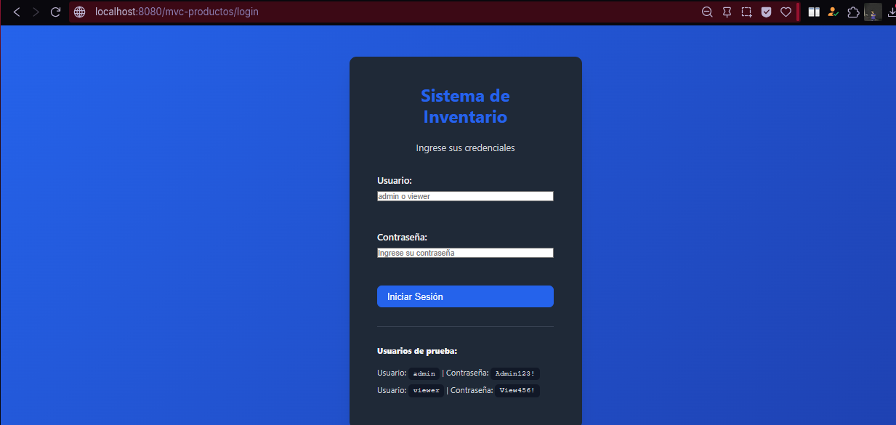
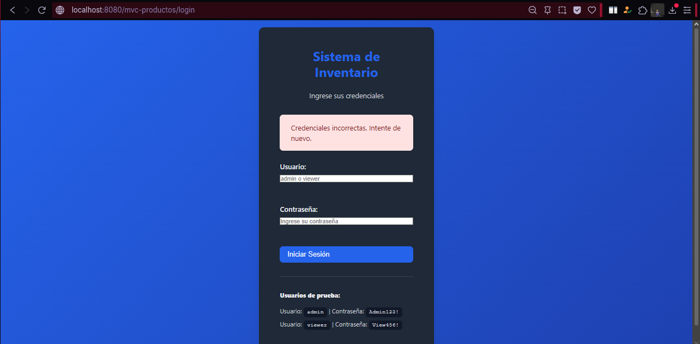
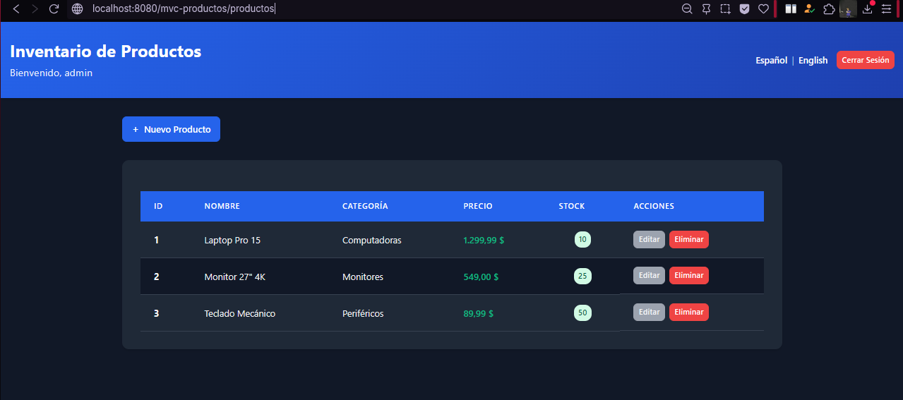
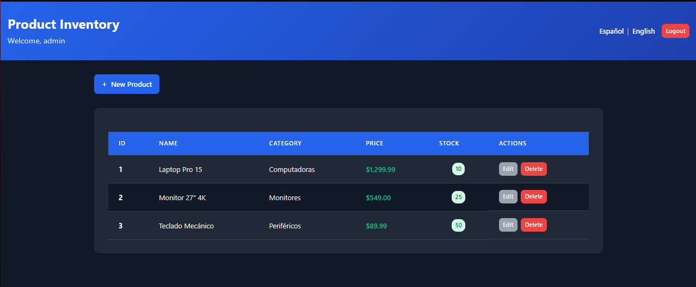
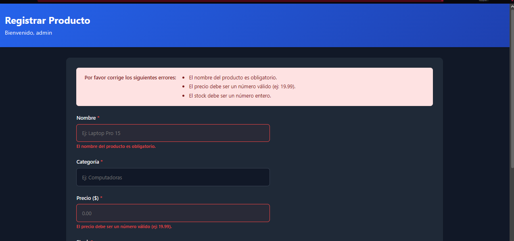
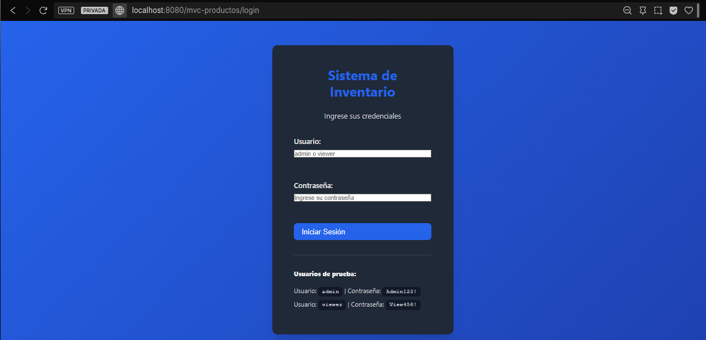
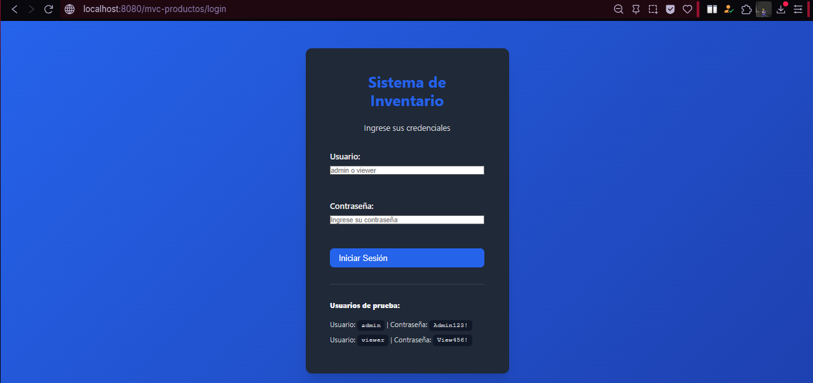

# MVC Productos - Autenticación, Validaciones e i18n

Aplicación Web Java con Patrón MVC, Autenticación, Validaciones e Internacionalización

---

## Autor

- **Nombre:** Jhoseth Esneider Rozo Carrillo
- **Código:** 02230131027
- **Programa:** Ingeniería de Sistemas
- **Unidad:** 6 - JSP con MVC
- **Actividad:** Post-Contenido 2 (Autenticación, Validaciones e i18n)
- **Fecha:** 18/04/2026

---

## Descripción del Proyecto

Sistema completo de gestión de inventario de productos implementado con el patrón MVC (Modelo-Vista-Controlador) en Java. Es una extensión del Post-Contenido 1 que ahora incluye:

- CRUD completo de productos (Crear, Leer, Actualizar, Eliminar)
- Autenticación con HttpSession con usuarios en memoria
- Validaciones robustas en servidor con retroalimentación de errores por campo
- Internacionalización (i18n) con soporte para Español e Inglés
- Selector de idioma persistido en sesión
- Patrón Post-Redirect-Get para operaciones seguras
- Interfaz responsiva y moderna con CSS3 semántico
- Seguridad de sesión con timeout y cierre seguro

---

## Funcionalidades Principales

### Autenticación (Login)

- Login con usuario y contraseña
- Manejo de sesión con HttpSession
- Roles básicos: ADMIN y VIEWER
- Cierre de sesión

- Usuarios de prueba:
- admin / Admin123! (Rol: ADMIN)
- viewer / View456! (Rol: VIEWER)

Características:

- Validación de credenciales en servidor
- Creación de sesión HttpSession
- Timeout de inactividad: 30 minutos
- Redireccionamiento automático a login si sin sesión
- Cierre seguro de sesión (invalidar)

### CRUD de Productos

Crear (Create):

- Formulario vacío
- Validación de campos
- Guardar y redirigir con mensaje

Leer (Read):

- Listar todos los productos
- Mostrar información en tabla
- Indicador de stock agotado

Actualizar (Update):

- Cargar datos existentes
- Validación de campos
- Guardar cambios y redirigir

Eliminar (Delete):

- Confirmación antes de eliminar
- Redirigir después de eliminar
- Mensaje de éxito

### Validaciones en Servidor

Campo: Nombre

- Obligatorio
- Máximo 100 caracteres
- Error específico si falla

Campo: Precio

- Formato numérico válido (ej: 19.99)
- No puede ser negativo
- Error específico si falla

Campo: Stock

- Formato entero válido
- No puede ser negativo
- Error específico si falla

Retroalimentación:

- Mensaje de error por campo
- Resaltado visual del campo con error
- Repoblación del formulario con valores previos
- Múltiples errores mostrados en lista

### Internacionalización (i18n)

Idiomas soportados:

- Español (messages_es.properties)
- Inglés (messages.properties)

Elementos traducidos:

- Títulos y encabezados
- Labels de formularios
- Botones de acción
- Mensajes de éxito/error
- Validaciones

Características:

- Selector de idioma en header
- Cambio dinámico sin recarga de página
- Persistencia en sesión

---

## Objetivo

Construir una aplicación web completa que:

- Implemente autenticación de usuarios
- Proteja recursos mediante sesión
- Valide datos en el servidor con mensajes claros
- Soporte múltiples idiomas con ResourceBundle
- Mantenga separación clara de responsabilidades (MVC)

---

## Prerrequisitos

Para ejecutar el proyecto se requiere:

- Java JDK 11 o superior
- Apache Tomcat 10.x o 11.x
- IntelliJ IDEA o Eclipse con Tomcat configurado
- Maven 3.8.x o superior
- Git y cuenta en GitHub
- Navegador web moderno (Chrome, opera, Edge)

---

## Estructura del Proyecto

- mvc-productos/
- ├── src/main/java/com/universidad/mvc/
- │ ├── model/
- │ │ ├── Producto.java
- │ │ ├── ProductoDAO.java
- │ │ └── Usuario.java
- │ ├── service/
- │ │ └── ProductoService.java
- │ └── controller/
- │ ├── ProductoServlet.java
- │ ├── LoginServlet.java
- │ └── IdiomaServlet.java
- ├── src/main/resources/
- │ ├── messages.properties
- │ └── messages_es.properties
- ├── src/main/webapp/
- │ ├── WEB-INF/
- │ │ ├── web.xml
- │ │ └── views/
- │ │ ├── lista.jsp
- │ │ ├── formulario.jsp
- │ │ ├── login.jsp
- │ │ └── error.jsp
- │ ├── css/
- │ │ └── estilos.css
- │ └── index.jsp
- └── pom.xml

---

## Arquitectura MVC

Modelo:

- Producto: entidad principal
- Usuario: representa el usuario autenticado
- ProductoDAO: acceso a datos en memoria

Servicio:

- ProductoService: contiene validaciones y lógica de negocio

Controlador:

- ProductoServlet: CRUD de productos
- LoginServlet: autenticación
- IdiomaServlet: cambio de idioma

Vista:

- JSP con JSTL y EL
- Sin uso de scriptlets
- Ubicadas en WEB-INF/views

---

## Instrucciones de Ejecución

1. Clonar el repositorio:

https://github.com/jerc31/rozo-post2-u6.git

### 2. Abrir en IntelliJ IDEA

### 3. Compilar proyecto

desde consola:

mvn clean package

### 4. Configurar Apache Tomcat

- Instalar Apache Tomcat
- Run → Edit Configurations
- Clic en +
- Seleccionar Tomcat Server → Local
- Configurar

### 5. Desplegar aplicación

### 6. Ejecutar aplicación

Abrir en el navegador en:
http://localhost:8080/mvc-productos/login

---

## Checkpoints de Verificación

- Acceder a /productos sin login redirige a /login
- Login incorrecto muestra error sin cambiar la URL
- Login correcto redirige a /productos
- Usuario visible en la vista con sessionScope
- Validaciones muestran errores por campo
- Formulario conserva datos al fallar validación
- Cambio de idioma funciona (es/en)
- Idioma persiste entre páginas
- Logout invalida sesión correctamente

---

## Capturas de Pantalla

Las siguientes capturas se encuentran en la carpeta `/evidencias/`:

# Redirección a login

## Credenciales incorrectas

## Iniciar sesion con usuario admin

## Cambiar idioma (Español - English)

## Error por no ingresar nombre

## Redirección a login pestaña incognito

## Cerrar sesión

---

## Conclusión

Este proyecto demuestra una implementación completa del patrón MVC en Java Web, integrando autenticación, validaciones robustas e internacionalización, cumpliendo con todos los requisitos del laboratorio y buenas prácticas de desarrollo web.
